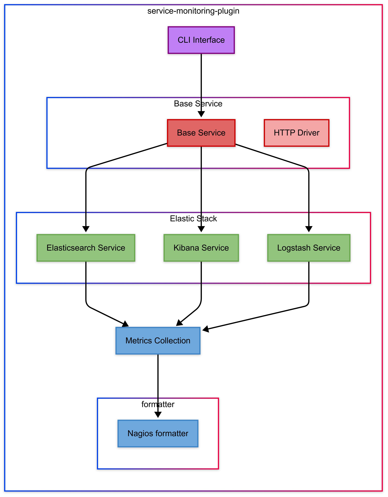

# Service Monitoring Plugin

## Overview

The **Service Monitoring Plugin** is a Python-based monitoring tool for checking the health status of **Elasticsearch, Kibana, and Logstash** services. It uses **Nagios-compatible exit codes** (OK, WARNING, CRITICAL, UNKNOWN) and can be integrated with **Icinga2** for automated service monitoring.

## Features
- Monitors **Elasticsearch, Kibana, and Logstash** health statuses.
- Uses **Nagios exit codes** for structured monitoring.
- Provides **CLI-based** execution for easy use.
- Supports **Icinga2 integration** for automated checks.
- Includes **unit tests** for robust reliability.

## General structure



## Dependencies

This project uses the following Python libraries:
- **[`nagiosplugin`](https://pypi.org/project/nagiosplugin/)** – Nagios-compatible exit codes.
- **[`requests`](https://pypi.org/project/requests/)** – HTTP API calls.
- **[`click`](https://pypi.org/project/click/)** – CLI support.
- **[`pytest`](https://pypi.org/project/pytest/)** – Testing framework.
- **[`unittest`](https://docs.python.org/3/library/unittest.html)** – Unit testing.
- **[`unittest.mock`](https://docs.python.org/3/library/unittest.mock.html)** – Mock API responses.

## Installation

```sh
# Clone the repository
git clone https://github.com/AzraelG/service-monitoring-plugin.git
cd service-monitoring-plugin

# Create a virtual environment
python3 -m venv venv
source venv/bin/activate

# Install dependencies
pip install -r requirements.txt
```

## Usage

Run the service check script with:
```sh
python3 src/check_services.py --check elasticsearch --endpoint https://localhost:9200 --user elastic --password changeme
```
## Health Check Endpoints

| Service          | Endpoint                  | OK           | WARNING     | CRITICAL   | UNKNOWN       |
|-----------------|--------------------------|-------------|------------|------------|--------------|
| Elasticsearch   | `/_health_report`        | `green`     | `yellow`   | `red`      | `unknown`    |
| Kibana         | `/api/status`            | `available` | `degraded` | `critical` | `unavailable` |
| Logstash       | `/_node/stats/process`   | `<70% CPU`  | `70-85%`   | `>85%`     | `No data`    |

## Testing

Run unit tests using:
```sh
pytest tests/unit
```

## Icinga2 Integration

To integrate with Icinga2, you can refer to the examples provided in the [icinga2_integration](icinga2_integration) folder. This folder contains configuration templates and sample scripts to help set up automated service checks in your Icinga2 monitoring system.

## License

This project is licensed under the [MIT License](LICENSE).

---